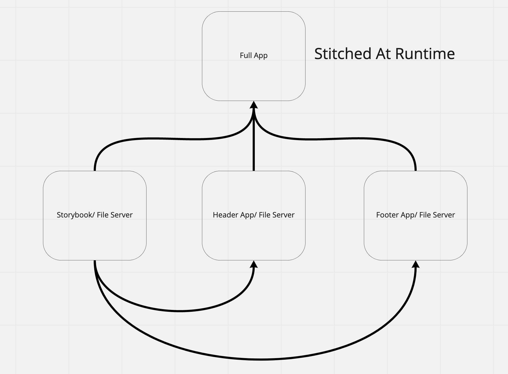

# Webpack 5 Playground

This is a playground to experiment with Webpack 5, in particular its new `ModuleFederationPlugin`

## Getting Started

`yarn && yarn dev`

This will start 3 webpack dev servers and 1 storybook server:

Webpack Dev Servers:

- The Header Server (`http://localhost:3001`)
- The Footer Server (`http://localhost:3002`)
- The App Server (`http://localhost:3000`)

Storybook Server:

- The "Design System" (Chakra-UI 'cause I ain't writing no fancy components. This is just to explore Storybook as a Webpack 5 remote entrypoint) (`http://localhost:6006`)

The Main App pulls dependencies from the Header, Footer, and Design System servers, at runtime, and "stitches" them together to form a full application. It's magic 🌟

### Prove that it works

Navigate to `http://localhost:3000` to see the awesome app ;)!

Now let's say the Design System team wants to make a change. They want to remove that ugly border on the `Box` component in the design system. Let's go ahead and do that:

`packages/design-system/src/components/Box/index.jsx`
```javascript
const StyledBox = styled(Box)`
  border: 2px solid black; <-- Remove this line
`
```

Go ahead and save and let Storybook rebuild your component. Now refresh the page on `http://localhost:3000`. Notice that the border on our header and footer is gone! Again, our app does not have a dependency on our Design System at build time (check its `package.json` if you don't believe me), but at _run time_. The components are fetched by Webpack at runtime using Module Federation and made available to our app. **Your Storybook is now a component host for your design system, the one source of truth for documentation and distribution.**

### So what?

This means any updates to your design system happen the instant your design system changes, across all of your apps. No more bumping dependencies and creating new artifacts to get those design system changes live.

## Why

Typically, frontends are monolithic, having a manifest of dependencies, usually a `package.json`, and is deployed altogether as a single artifact. Any components that the application depends on is ususally included as a _versioned_ dependency in the `package.json` and then imported throughout the project. This works great for small applications.

As an application grows, different teams may have responsibility over different parts of the app or components the app depends on. Addtionally when new versions of the components are published, versions have to be bumped in the main application `package.json`, new artifact be built, and deployed, in order for those components to truly be "live". We now have multiple teams coupled to single release cycle -- Welcome to the Monolith!

This repo is cutting against that approach, and is effectively an experiment in a microfrontend architecture. There is a lot of baggage with the term "microfrontend", but here is a nice writeup about this approach [here](https://martinfowler.com/articles/micro-frontends.html)

## What's in the repo

In this repo, we have the Header, Footer, Design System, and App "teams". These teams are responsible for parts of an application, developing, testing, and _deploying_ those pieces. The most valuable thing this approach gains us is that development teams can ship new versions of their parts of the application, live to production, without having to depend on the release cycle of the main application. The pieces are "stitched" at runtime in the main application using Webpack 5 Module Federation. **This feature is still in beta**


